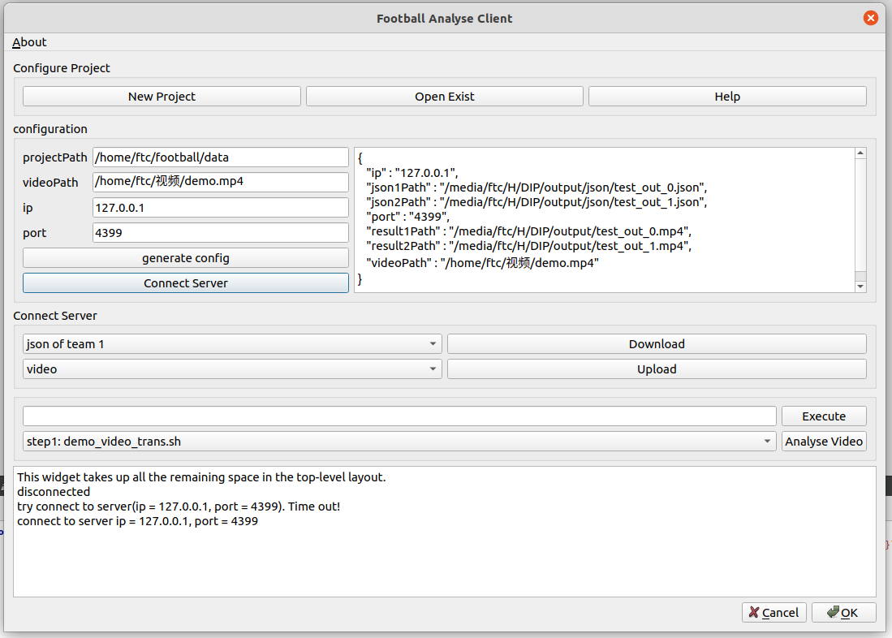
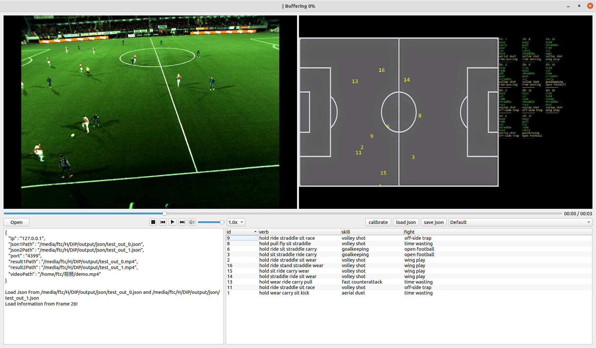

# 足球视频分析系统

## 作者

* 陆徐东  2858850195@qq.com
* 方天宬  1773701277@qq.com

<center class="half">
 
</center>

## 简介

本项目是SJTU 21-22学年`CS386 数字图像处理`课程的大作业，本文是足球视频分析系统的参考文档。我们主要实现了以下功能：

1. 基于Yolo v5和PastaNet搭建了足球视频的分析神经网络，能够对球员位置、球员姿态和动作进行识别，也能对球队战术进行初步识别
2. 基于Qt6搭建了一套足球分析系统，包括服务端和客户端：客户端上传视频到服务端，分析完成后再下载结果并展示


## 使用方法

* 服务端：
  1. 需要一台装有NVIDIA20系列显卡，并且装有cuda10.2的Linux电脑（如果你打算用CPU运行神经网络，没有显卡也可以）
  1. 配置python环境，输入`conda env create -n activity2vec -f DIP/HAKE-Action-Torch-Activity2Vec/activity2vec.yaml`和`conda env create -n yolo -f DIP/Yolov5_DeepSort_Pytorch/yolo.yaml`
  2. 在Linux环境下用Qt6编译`src/server-console/server-console.pro`，如果是在docker中，那么还需用`ldd`命令找到所需的库文件，将编译好的可执行文件和库文件一起拷贝到docker
  2. 修改`DIP`文件夹下面三个`.sh`脚本，将其中的`$PYTHON_PATH`改成自己conda环境中对应的python位置
  3. 将编译好的`server-console`放到`DIP`文件夹下，运行之
  
* 客户端：
  1. 下载并安装Qt6
  2. 用Qt6打开`src/layouts/basiclayouts.pro`，编译之
  2. 把`DIP/GUI`中的`get_place.py`打包成`get_place.exe`，并与第二步编译好的文件放在同一目录下
  2. 运行第二步编译好的文件

## 文件夹

```
DIP  神经网络方面
|-- GUI            人工校准GUI
|-- inputfile      输入文件
|-- Yolov5_DeepSort_Pytorch
|-- HAKE-Action-Torch-Activity2Vec
...

src  图像界面方面
|-- layouts        客户端
|-- server-console 服务端

report 报告
```


## 注意

* 我们在此处没有提供全套`DIP`文件夹，它足足有7.2G，您可以根据下面的链接下载环境

  ```
  链接: https://pan.baidu.com/s/1PiAyDIr59o5IvgcjAnUylw  密码: 0gso
  --来自百度网盘超级会员V5的分享
  ```

  

# Football Video Analyse System

* Xudong Lu  2858850195@qq.com
* Tiancheng Fang  1773701277@qq.com


## Introduction

This project is a major assignment of `cs386 digital image processing` course of SJTU 21-22 academic year. This tutorial is a reference document for football video analysis system. We mainly realize the following functions:

1. We build a football video analysis neural network, which can identify the player's position, player's posture and action, and also preliminarily identify the team's tactics.
2. We construct a football analysis system based on Qt-6, including server and client: the client uploads the video to the server, downloads the results and displays them after analysis.


## Usage

* Server:
  1. You need a CUDA 10.2 Linux computer with NVIDIA 20 series graphics card \(If you plan to run neural networks with CPU, you can do it without a graphics card\)
  2. Build the python environment, enter `conda env create -n activity2vec -f DIP/HAKE-Action-Torch-Activity2Vec/activity2vec.yaml` and `conda env create -n yolo -f DIP/Yolov5_DeepSort_Pytorch/yolo.yaml`
  3. Compile ` src/server-console/server-console.pro` in Linux Qt6. If you decide to run it in docker, you also need `ldd` command to find the required library, then copy the executable file and the library to docker
  4. Modify the three `.sh` script in folder `DIP`, change `$PYTHON_PATH` to the corresponding Python location in your conda environment
  5. Put the executable `server-console` into the `DIP` folder, then run it

* Client:
  1. Download and install Qt6
  2. Open `src/layouts/basiclayouts.pro` with Qt6, then compile it
  3. Pack the `DIP/GUI/get_place.py` to `get_place.exe` and put it in the same directory as the files compiled in step 2
  4. Run the file compiled in step 2


## Directory

```
DIP  # about neural network
|-- GUI            # calibrate GUI
|-- inputfile      
|-- Yolov5_DeepSort_Pytorch
|-- HAKE-Action-Torch-Activity2Vec
...

src  # about GUI
|-- layouts        # client
|-- server-console # server

report 报告
```


## Note

* We don't provide a full set of `DIP` folders here. It takes up 7.2G of space. You can download the environment according to the link below:

  ```
  URL: https://pan.baidu.com/s/1PiAyDIr59o5IvgcjAnUylw
  password: 0gso
  ```

  
